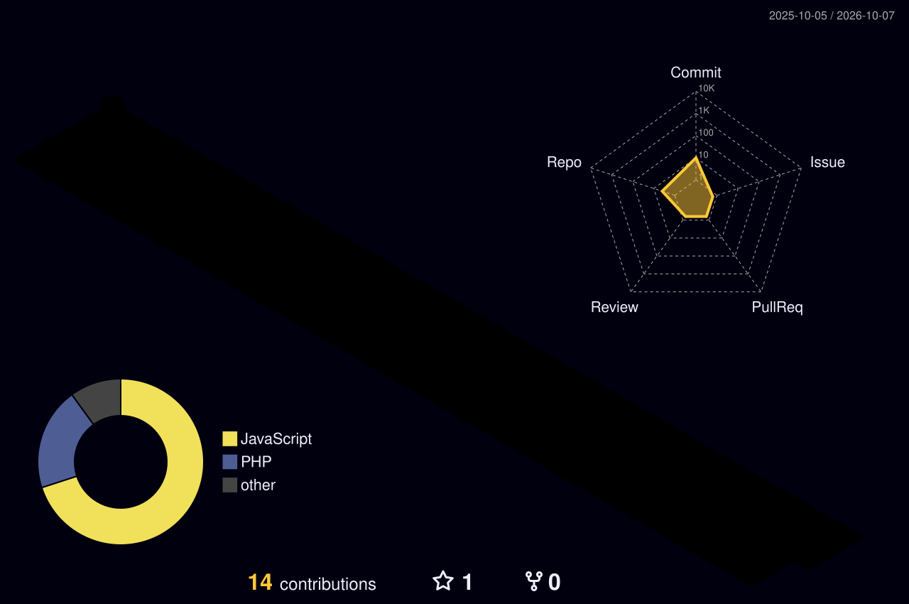

  <!-- 1. HERO VIEWFINDER & BRAND CARD -->
  

    

  <!-- QUICK NAVIGATION BADGES -->
  
  
  

    

  <!-- 2. CAPABILITIES BROWSER & HOBBIES STORY CAROUSEL -->
  

    

  <!-- 3. PLANETARY TECH ORBIT & CHIP GRID -->
  

    

  <!-- 4. HOLOGRAPHIC ID BADGE & SYSTEM TELEMETRY -->
  

---

## 🏛️ Featured Enterprise Ecosystem & Production Architectures

Rather than isolated hobby repositories, my engineering work centers on high-throughput, multi-tenant enterprise business software under the **VersalFlow** ecosystem:

| Platform / Repository | Architecture & Core Capabilities | Primary Stack | Operational Status |
| :--- | :--- | :--- | :--- |
| **[VersalFlow CRM](https://github.com/Deepakvalmigi)** | Multi-tenant lead qualification pipeline, automated deal forecasting, real-time stage triggers & WhatsApp messaging hooks. | `Next.js 14` `Node.js` `MySQL` `Tailwind` |  |
| **[VersalFlow ODMS](https://github.com/Deepakvalmigi)** | Order & Dealer Distribution Engine. Handles multi-warehouse inventory allocation, dealer orders, and automated delivery routing. | `Express.js` `MySQL` `PM2 Cluster` `Linux` |  |
| **[WhatsApp Omnichannel Gateway](https://github.com/Deepakvalmigi)** | High-concurrency broadcast manager, interactive templating engine, webhook routing, and customer support ticket sync. | `Node.js` `Cloud API` `Webhooks` `Redis` |  |
| **[AI Business Automation Suite](https://github.com/Deepakvalmigi)** | Autonomous agent workflows using OpenAI models to parse customer sentiment, classify inbound leads, and generate executive reports. | `Python` `OpenAI API` `LangChain` `JSON-RPC` |  |
| **[Commerce & Mobile App Suite](https://github.com/Deepakvalmigi)** | Unified D2C e-commerce checkout engine paired with a cross-platform mobile shopping experience, real-time push tracking & loyalty rewards. | `Flutter` `Dart` `Firebase RTDB` `REST API` |  |

---

## 🌆 3D Contribution City Skyline

  
<i>Automated 3D night-view isometric skyline refreshed daily via GitHub Actions:</i>

  

---

## 📈 System Metrics & GitHub Velocity

  <table border="0" width="100%">
    <tr>
      <td width="50%" align="center" valign="top">
        
      </td>
      <td width="50%" align="center" valign="top">
        
      </td>
    </tr>
  </table>

   

  <!-- Top Languages Card -->
  

---

## 🤝 Let's Connect & Collaborate

  <!-- 5. CONNECT FOOTER CARD -->
  

    

  

    <b>Designed &amp; Engineered with Precision by Deepak • Founder @ VersalFlow</b> 
    <i>"Building scalable digital foundations that empower modern businesses to operate autonomously."</i>
  

