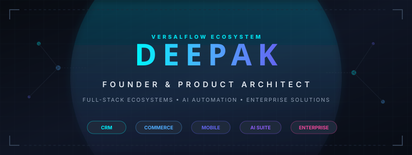
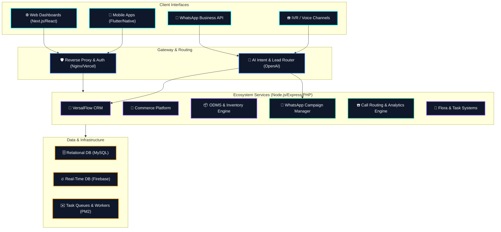

  <!-- Premium Custom Hero Banner -->
  
  
    
  
  <!-- Animated Typing Tagline -->
  

   

  <!-- High-Level Quick Stats Badges -->
  
  
  

---

## 👨‍💼 Executive Founder Profile

Deepak is a hands-on technology founder, principal full-stack architect, and digital product innovator. As the founder of **VersalFlow**, he designs, builds, and maintains a unified suite of enterprise software solutions, CRM systems, mobile apps, and conversational AI tools. 

Deepak specializes in converting complex, multi-layered enterprise workflows into cohesive, fast, and automated systems. His design philosophy centers on **omni-channel automation**, **real-time database consistency**, and **pragmatic AI integration** to fuel operational growth.

> [!IMPORTANT]
> ### 🎯 Core Mission
> **To build scalable, robust, and beautifully integrated business software that empowers organizations to manage sales, logistics, commerce, communications, customer support, and intelligence from a single unified ecosystem.**

---

## 🏢 The VersalFlow Product Ecosystem

Rather than isolated repositories, Deepak's work represents a deeply connected software suite that serves modern companies from lead generation to post-sale support.

### 🏛️ Pillar 1: CRM & Support Solutions
*   **VersalFlow CRM**  
    *Enterprise-grade lead-to-deal tracker.* Features visual drag-and-drop sales pipelines, real-time lead qualification, team collaboration tools, and WhatsApp call-tracking integration for seamless customer acquisition.
*   **Customer Support Platform**  
    *Omnichannel helpdesk manager.* Resolves tickets across email, WhatsApp, live chat, and voice calls. Built-in support history helps agents address queries with full customer context.

### 📦 Pillar 2: Commerce & Distribution Systems
*   **Order & Dealer Management System (ODMS)**  
    *High-throughput B2B distribution hub.* Offers automated dealer onboarding, fast order entry, multi-warehouse stock visibility, and distribution routing for complex logistics.
*   **E-Commerce Platform**  
    *D2C sales engine.* Features catalog configuration, multi-currency checkout, dynamic inventory matching, payment gateway integrations, and automatic shipping rate calculations.
*   **E-Commerce Mobile Application**  
    *Premium cross-platform mobile shopping experience.* Built with Flutter for iOS & Android. Integrates real-time push notifications, live order tracking, and a loyalty points ledger.
*   **Inventory Management System**  
    *Warehouse control center.* Features multi-location stock tracking, low-stock forecasts, purchase order automation, and supplier relationship metrics.

### 💬 Pillar 3: Omnichannel Communication Engine
*   **WhatsApp Business Platform**  
    *Enterprise messaging at scale.* Orchestrates broadcasts, manages interactive templates, and handles structured campaign tracking while automating responses to common customer inquiries.
*   **IVR & Call Management Platform**  
    *Cloud telephony operations.* Features call routing, queue management, agent assignments, call recording, and real-time talk-time analytics.

### 🤖 Pillar 4: AI & Business Intelligence
*   **AI Business Automation Suite**  
    *Autonomous operations engine.* Connects OpenAI model integrations to auto-qualify leads, generate smart dashboard insights, and trigger automated follow-up operations.
*   **Analytics and Reporting Platform**  
    *Executive dashboards.* Connects direct relational databases to show real-time metrics, pipeline velocity, team productivity, and revenue projections.

### 📋 Pillar 5: Operations & Internal Tools
*   **Task Management Platform**  
    *Internal collaboration tool.* Features task assignments, dependencies, automated task updates, and developer/employee productivity tracking.
*   **Flora Application**  
    *Custom business operations manager.* A niche automation and workflow tool customized for agricultural and local product distribution tracking.
*   **Visitor Management System**  
    *Enterprise physical security logging.* Digital tablet sign-ins, custom approval workflows for security hosts, guest badging, and automated compliance logs.

---

## 🛠️ Technology Architecture

Deepak designs systems with a focus on modularity, zero-latency rendering, and low maintenance overhead. His stacks are selected to balance developer velocity with enterprise robustness.

<table width="100%">
  <tr>
    <td width="50%" valign="top">
      <h4>💻 Frontend &amp; Interaction</h4>
      
      
      
      
    </td>
    <td width="50%" valign="top">
      <h4>⚙️ Backend &amp; Architecture</h4>
      
      
      
      
    </td>
  </tr>
  <tr>
    <td width="50%" valign="top">
      <h4>🗄️ Database &amp; Cache</h4>
      
      
    </td>
    <td width="50%" valign="top">
      <h4>☁️ Cloud, DevOps &amp; Execution</h4>
      
      
      
      
      
    </td>
  </tr>
  <tr>
    <td colspan="2" valign="top">
      <h4>🤖 Artificial Intelligence &amp; NLP</h4>
      
      
      
    </td>
  </tr>
</table>

---

## 📈 System Performance & GitHub Metrics

  <table border="0">
    <tr>
      <td width="50%" align="center">
        <!-- Main Stats Card -->
        
      </td>
      <td width="50%" align="center">
        <!-- Streak Stats Card -->
        
      </td>
    </tr>
  </table>

   

  <!-- Contribution Graph -->
  

---

## 🏆 Key Milestones & Innovation Areas

*   **Ecosystem Scale**: Designed the multi-tenant architecture for VersalFlow, consolidating CRM, Commerce, and Communications into a single database schema with distinct organizational isolation.
*   **WhatsApp CRM Integration**: Built custom Webhooks integration that links real-time customer WhatsApp messages directly into the VersalFlow sales pipeline, triggering instant notifications.
*   **High Performance Telephony**: Integrated low-latency VoIP/IVR routing with PM2 background workers and Firebase Realtime Database to update caller queue dashboards instantly.
*   **Agentic Business Reporting**: Implemented Next.js middleware combined with OpenAI LLM endpoints to parse complex operational metrics, providing plain-text insights for executive teams.

---

## 🔭 Current Focus & Future Vision

*   **🚀 Current Focus**: Enhancing **VersalFlow CRM's** WhatsApp broadcasting limits and scaling **ODMS** distribution pipelines to handle peak seasonal orders.
*   **🔮 Future Vision**: Transitioning the entire VersalFlow suite toward zero-maintenance, self-learning workflows—where conversational AI agents handle customer support, inventory reordering, and campaign adjustments autonomously.

---

## 🤝 Connect with the Founder

If you are a builder, startup founder, investor, or client looking to automate operations, feel free to reach out. Let's discuss technical architecture, system design, or business automation.

  
  
  
  

 

  <b>Ecosystem Architected &amp; Maintained by Deepak • Powered by VersalFlow</b>

